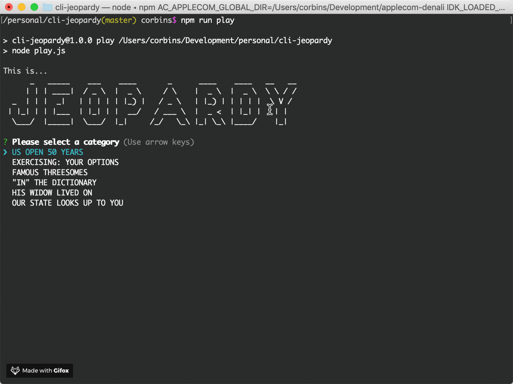

# cli-jeopardy

## Overview
Play Jeopardy! from your Terminal like a boss while people think you're doing something complicated like configuring a Linux server!

Answer clues from real Jeopardy! episodes. cli-jeopardy calculates your score based on your responses.

## How to Play
1. clone the repo
2. `npm install`
3. `npm run play`
4. Answer the clues!

## Technical highlights
- `parse.js`: a NodeJS script that parses complex HTML pages from http://j-archive.com/ and reformats them into JSON to be consumed by the game
- `play.js`: a NodeJS script that allows users to answer clues from a CLI
- Uses InquirerJS, a promise-based library for CLI prompting and Chalk for outputting rich colors to the console

